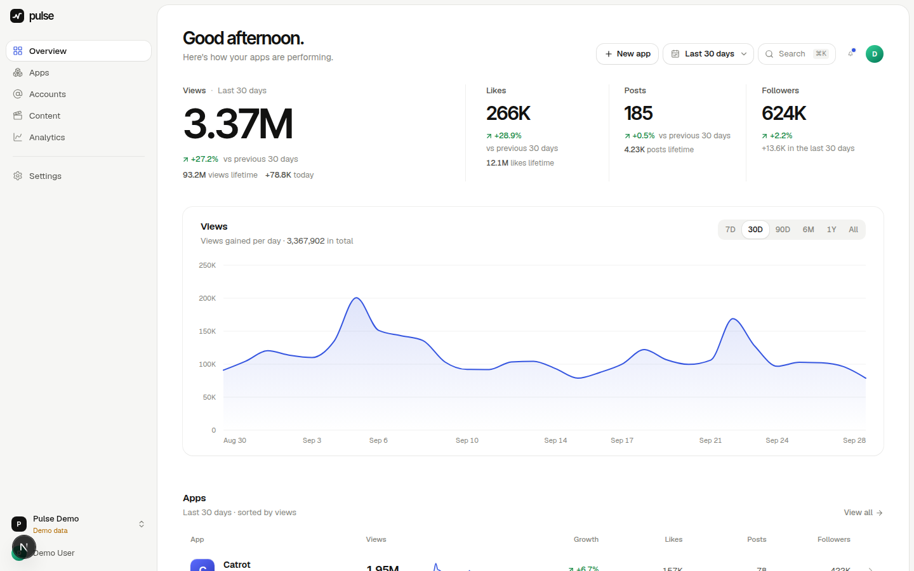
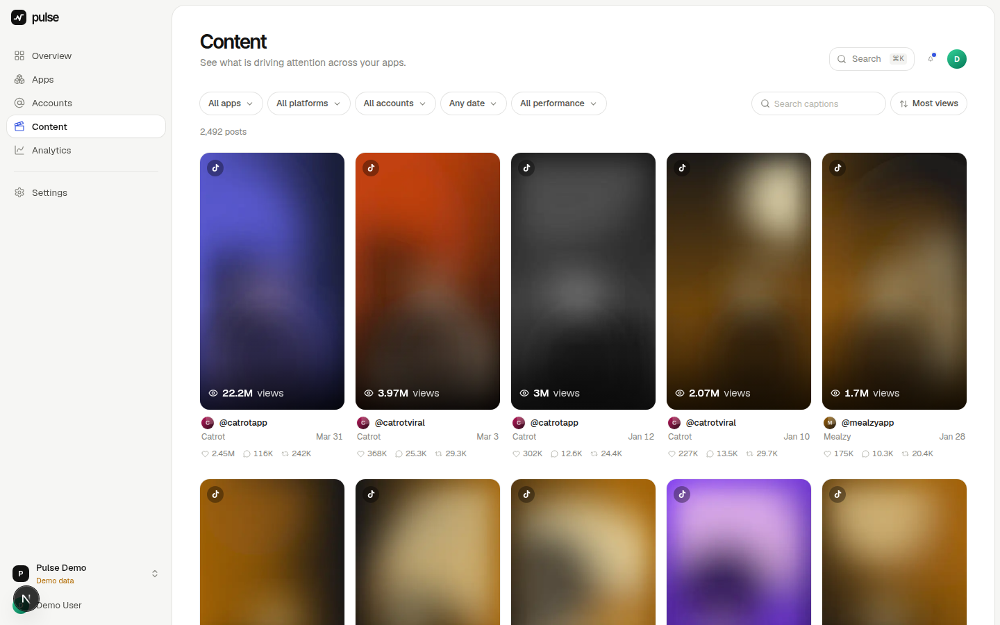
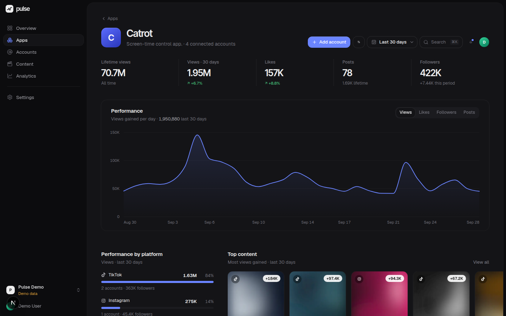

# Pulse

**Pulse is the internal command center for understanding how much social-media attention every one of our mobile apps is generating.**

Create an app → paste its public social profiles → Pulse collects the available metrics in the background, keeps an append-only history, and turns it into one calm, fast dashboard.



| Content library | App page (dark) |
|---|---|
|  |  |

<sub>Screenshots show the demo workspace (synthetic data).</sub>

---

## Quick start

Requirements: Node 22+, pnpm 10, PostgreSQL 14+.

```bash
pnpm install
cp .env.example .env            # set DATABASE_URL, APP_URL
pnpm db:deploy                  # apply migrations (pnpm db:migrate in development)
pnpm dev                        # web app + background worker
```

Open http://localhost:3000. The first visit shows **Set up Pulse**, which creates the first admin and workspace. Admins invite teammates from **Settings → Members** (invite links).

Or from the CLI:

```bash
pnpm pulse:create-admin --email you@company.com --name "You" --password "…" --workspace "Acme Apps"
```

### Demo data (UI development only)

```bash
PULSE_ENABLE_DEMO=true pnpm db:seed:demo    # sign in: demo@pulse.local / pulse-demo-2026
```

This creates a **separate workspace flagged `isDemo`** (clearly badged "Demo data" in the UI) with ~400 days of synthetic history. Mock data never touches a real workspace: the mock connector is only registered when `PULSE_ENABLE_DEMO=true` and the registry only hands it to demo workspaces. A real workspace with an unconfigured platform shows **Data unavailable**, never invented numbers.

### Scripts

| Command | What it does |
|---|---|
| `pnpm dev` | Next.js dev server + worker (with reload) |
| `pnpm build` / `pnpm start` | Production build / server |
| `pnpm worker` | Background collection worker (run alongside `start`) |
| `pnpm test` | Unit tests; set `TEST_DATABASE_URL` to also run Postgres integration tests |
| `pnpm lint` / `pnpm typecheck` | ESLint / TypeScript |
| `node tests/e2e/flow.mjs <dir>` | Browser smoke test of the core workflow (demo workspace) |
| `node tests/e2e/shots.mjs <dir> / /apps …` | Screenshot pages at several widths (`--w=1440,375 --theme=dark`) |

---

## Data sources

Pulse uses official APIs and licensed providers only. It never bypasses logins, CAPTCHAs, private accounts or anti-bot protections. Anything a source doesn't expose is stored as `NULL` and shown as **N/A**. It is never converted to zero.

| Platform | Source | Configure | Notes |
|---|---|---|---|
| YouTube | YouTube Data API v3 (official) | `YOUTUBE_API_KEY` | Subscribers (unless hidden), lifetime channel views, video views, likes and comments. Shares aren't exposed (N/A). |
| Instagram | Graph API Business Discovery (official) | `META_IG_BUSINESS_ACCOUNT_ID`, `META_ACCESS_TOKEN` | Works for Business/Creator profiles. Followers, following, media count, likes and comments. Views and shares aren't exposed for third-party accounts (N/A). |
| TikTok | Pluggable licensed data provider | `TIKTOK_PROVIDER=http`, `TIKTOK_PROVIDER_BASE_URL`, `TIKTOK_PROVIDER_API_KEY` | TikTok has no official API for other profiles' metrics from a URL. Plug in a provider; until then TikTok accounts show *Data unavailable*. |

**Settings → Data sources** shows what's configured (secrets are never sent to the browser).

### TikTok provider contract

`src/server/connectors/tiktok/providers/http.ts` speaks a small, documented JSON contract (`GET /tiktok/profile?username=`, `GET /tiktok/videos?username=&limit=`). Point it at a licensed vendor, or at a thin proxy in front of one. To support a vendor natively, add one file implementing `TikTokDataProvider` and a case in `tiktok/index.ts`.

---

## Architecture

```
src/
  app/                    Next.js App Router
    (app)/                authenticated product screens (client components + React Query)
    (auth)/               sign in, first-run setup, invite acceptance
    api/v1/…              REST API (all workspace-scoped, zod-validated, role-checked)
    api/media/[id]        cached images (icons, avatars, thumbnails)
    api/cron/tick         scheduler endpoint for hosts without a worker process
  components/
    ui/                   design-system primitives
    charts/               custom SVG charts (time series, sparkline, bar list)
    shell/                sidebar, header, range picker, ⌘K palette, modals
    pulse/                product components (KPIs, rows, content cards, flows)
  lib/                    shared, pure code: formatting, ranges, dates, URL parsing, DTO types
  server/
    connectors/           one folder per platform + registry + typed errors
    jobs/                 Postgres queue, sync pipeline, runner
    analytics/series.ts   pure analytics math (unit-tested)
    services/             data access per feature
    auth/                 sessions, passwords, roles
worker/index.ts           long-running collection worker
prisma/schema.prisma      data model
```

### Connectors

Every platform implements one interface (`src/server/connectors/types.ts`):

```ts
getProfile(ref)          → identity, bio, avatar, verified
getProfileMetrics(ref)   → followers, following, totalLikes, totalViews, postCount (number | null)
getPosts(ref, {limit})   → normalized posts with metrics
getPostMetrics(ref, ids) → metrics for known posts
```

The rest of the app only ever sees these normalized shapes. Failures are typed (`NOT_FOUND`, `PRIVATE`, `RATE_LIMITED`, `NOT_CONFIGURED`, …). Users see calm copy ("Instagram temporarily didn't return the requested data."), while the technical detail is stored for admins ("View details") and written to server logs. Requests are throttled per platform.

**Adding a platform** (X, Threads, Reddit…): add a value to the `Platform` enum, a folder in `connectors/`, a line in `registry.ts`, and URL rules in `lib/profile-url.ts`.

### Collection pipeline

1. Adding a profile URL validates it, detects the platform and extracts the handle (instantly, client-side and server-side). Duplicates per workspace are prevented by a unique constraint.
2. The account is created and an `INITIAL` **RefreshJob** is queued. The API also kicks it off right after responding, so it starts immediately with or without a worker.
3. A worker claims jobs with `FOR UPDATE SKIP LOCKED`. A partial unique index guarantees at most one in-flight job per account, so double-clicks and scheduler ticks can't pile up.
4. The sync moves through stages (checking profile → finding content → collecting metrics → finalizing), which drive the connect-flow progress UI. It upserts posts, **appends** account and post snapshots, updates the latest values and upserts the daily rollup.
5. Retries back off exponentially on transient errors. Stale locks are recovered.
6. Every minute the scheduler queues refreshes that are due: account override, or workspace default (1h / 6h / 12h / 24h / manual; default 6h).

On serverless hosts, call `GET /api/cron/tick` every minute with `Authorization: Bearer $CRON_SECRET` instead of running `pnpm worker`.

### Historical metrics & analytics

- `AccountMetricSnapshot` / `PostMetricSnapshot` are append-only: one row per collection, never overwritten.
- `AccountDailyMetric` keeps the last known cumulative values per account per day (in the workspace timezone). It's derived data that makes range queries cheap.
- Daily series are forward-filled between snapshots. Days before tracking began are unknown (null), not zero.
- Gains are computed **per account** and then summed, so a newly added account never shows up as a fake spike.
- **Flow metrics** (views, likes, posts) are *gained within the period*. **Stock metrics** (followers) are the *current level plus net change*.
- Growth % = (current − previous) ÷ previous × 100. It's withheld (never faked) when the previous value is 0 or unknown, or when history doesn't cover the whole previous period.
- Account views = lifetime views reported by the platform where available (YouTube), otherwise the sum of the latest known views of every tracked post. The UI says which.
- Engagement rate = (likes + comments + shares) ÷ views, shown only when the inputs exist.

The UI always labels **lifetime** separately from **this period** and **today**.

### Security

- argon2id password hashes. DB-backed sessions in httpOnly, SameSite=Lax cookies (Secure over HTTPS) with sliding expiry.
- Roles: **Admin** (settings, members, deletes), **Member** (apps, accounts, refresh), **Viewer** (read and export). Every handler goes through `route({ role })`, and every query is scoped by workspace.
- Origin checks on mutating requests. Login throttling counts only failed attempts, and unknown emails still pay the hashing cost. Uploads are validated and re-encoded, and CSV exports guard against formula injection.
- API keys live only in server environment variables (`server-only` modules). Nothing sensitive reaches the client.

### Performance

- Range analytics run on the daily rollup (one query per scope), not raw snapshots.
- Expensive reads (top content) are cached in-process, keyed by a workspace data version, so a new collection invalidates them automatically.
- Content is cursor-paginated with infinite scroll. Images are resized to WebP and served with immutable caching.
- React Query caches client data. The date range lives in the URL, so views are shareable.

---

## Design system

Tokens live in `src/app/globals.css`. The light theme is primary, and the dark palette is tuned separately rather than inverted. Visit **`/design`** in the app for a live reference of type, color, controls, charts, and loading, empty and error states.

- **Type**: Geist for UI, Inter Tight for display numbers. Tabular figures in columns.
- **Color**: neutral surfaces with one cobalt accent. Positive and negative deltas are quiet text colors. Platform hues appear only as tiny indicators.
- **Motion**: count-up metrics, chart reveal and morph between metrics, spring modals, sliding segmented controls. `prefers-reduced-motion` is respected.
